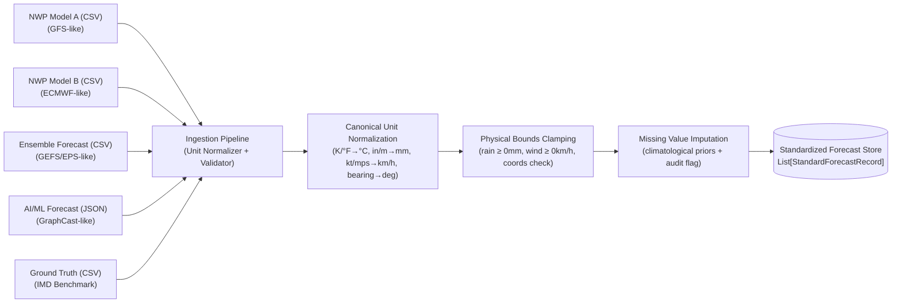

# Hybrid AI–NWP Multi-Model Forecast Blending System

> **Smart India Hackathon (SIH) Prototype**  
> **Ministry of Earth Sciences (MoES) / India Meteorological Department (IMD)**

An operational multi-model weather forecasting and hazard warning system that dynamically combines Numerical Weather Prediction (NWP) models (e.g., GFS, ECMWF IFS) with state-of-the-art AI weather models (e.g., DeepMind GraphCast, Pangu-Weather).

---

## 1. System Overview & Core Innovation

Different forecasting systems excel under different conditions:
- **AI Models (GraphCast / Pangu)** deliver exceptional rapid non-linear skill at short lead times ($T+24\text{h} \dots T+48\text{h}$) and on synoptic thermodynamic variables.
- **Physical NWP Ensembles (ECMWF / GFS)** maintain strict physical conservation laws and atmospheric stability across complex orography (e.g., Western Ghats, Himalayas) and extended lead horizons ($T+72\text{h} \dots T+168\text{h}$).

Rather than relying on static ensemble averages, this system employs an **Adaptive Softmax Simplex Meta-Learner**:
$$\mathbf{w}(x, y, t, \tau) = \text{Softmax}\big(f(\text{LeadTime}, \text{Terrain}, \text{Season}, \text{Regime}, \text{RollingSkill})\big)$$
$$\sum_{i} w_i = 1.0, \quad w_i \ge w_{\min}$$

### Key Features
- **Adaptive Multi-Model Weighting**: Dynamic weight adjustment across lead time, geographic zone, and active weather regime.
- **IMD Severe Hazard Advisory Engine**: Automated alerts for Heavy Rainfall ($>64.5\text{ mm}$), Heatwaves ($\ge 40^\circ\text{C}$ / $\ge 45^\circ\text{C}$), and Gale Winds ($\ge 50\text{ km/h}$) mapped to IMD Yellow, Orange, and Red action protocols.
- **Rigorous Verification & Skill Scorecards**: Built-in verification engine evaluating MAE, RMSE, Pearson Correlation, and Critical Success Index (CSI) against ground truth.
- **Interactive Operational GIS Dashboard**: Dark-mode glassmorphic interface with interactive station meteograms, 10th–90th percentile ensemble confidence bounds, and regional weight radar breakdown.

---

## 2. Project Directory Structure

```
MOES/
├── backend/
│   ├── app/
│   │   ├── main.py                     # FastAPI application entrypoint & CORS
│   │   ├── config/                     # Settings & domain bounds (6-38°N, 68-98°E)
│   │   ├── models/                     # Pydantic domain models (Forecasts, Weights, Alerts)
│   │   ├── services/                   # Modular provider interfaces & blending services
│   │   │   ├── provider_interface.py   # Abstract BaseForecastProvider
│   │   │   ├── simulated_provider.py   # Baseline simulated provider (swappable with real feeds)
│   │   │   ├── blender_interface.py    # Abstract BaseBlender
│   │   │   ├── blender_service.py      # Adaptive Softmax Simplex blending engine
│   │   │   ├── regime_service.py       # Synoptic atmospheric regime classifier
│   │   │   ├── extreme_service.py      # IMD threshold evaluation & hazard generator
│   │   │   └── verification_service.py # Statistical verification (MAE, RMSE, CSI)
│   │   ├── ml/                         # ML feature extraction & weight models
│   │   ├── data/                       # India reference observatories & spatial mesh
│   │   ├── utils/                      # Meteorological conversions & geospatial distance
│   │   └── api/                        # FastAPI v1 REST routes
│   └── requirements.txt
│
├── frontend/
│   ├── package.json                    # React 18, Vite, Leaflet, Chart.js
│   ├── vite.config.js                  # Proxy configuration to backend:8000
│   └── src/
│       ├── components/                 # Navbar, RegimeBanner, AlertsPanel
│       ├── charts/                     # MeteogramChart, SkillChart, WeightRadar
│       ├── maps/                       # WeatherMapView (Interactive GIS with Leaflet)
│       ├── pages/                      # Dashboard.jsx
│       ├── services/                   # Axios API client
│       ├── styles/                     # Dark-mode glassmorphism design system
│       └── types/                      # Frontend constants and metadata
│
├── data/
│   ├── raw/                            # Ingested raw model outputs
│   ├── processed/                      # Regridded spatial arrays
│   └── sample/                         # Reference sample datasets
│
├── configs/
│   ├── default.yaml                    # System configuration & model registry
│   └── imd_thresholds.yaml             # Official IMD warning criteria
│
├── scripts/
│   └── run_backend.py                  # CLI runner for local development
├── tests/                              # Unit & integration test suite
└── README.md
```

---

## 3. Forecast Data Ingestion Layer

The ingestion architecture uses a common `BaseForecastSource` interface with dedicated adapters for different formats and forecast paradigms:



### Standardized Record Schema
Each forecast record guarantees the following canonical attributes:
- `timestamp`: Valid forecast datetime (ISO-8601).
- `latitude` & `longitude`: Geographic coordinate in decimal degrees.
- `forecast_variable`: Standardized enum (`temperature`, `rainfall`, `wind_speed`, `wind_direction`).
- `forecast_value`: Normalized floating-point value in canonical units.
- `forecast_initialization_time`: Model run initialization datetime.
- `lead_time_hours`: Forecast horizon in hours ($0 \dots 168\text{h}$).
- `source_name`: Source model label (`NWP Model A`, `NWP Model B`, `Ensemble Forecast`, `AI/ML Forecast`).
- `region`: Meteorological sub-region (e.g. `Western Ghats`, `Indo-Gangetic Plains`).
- `season`: Active season (`monsoon`, `post_monsoon`, `winter`, `pre_monsoon`).
- `weather_regime`: Diagnosed synoptic regime (`monsoon_active`, `heatwave_synoptic`, etc.).
- `quality_flag`: Data provenance (`VALID`, `IMPUTED`, `CLAMPED`, `REJECTED`).

### Implemented Model Profiles in Prototype
| Source | Type | Format | Accuracy Characteristics |
|---|---|---|---|
| **NWP Model A** | Physics (GFS-like) | CSV | High spatial detail; systematic wet bias (+20%) on light rainfall; cold bias in plains (-1.5°C). |
| **NWP Model B** | Physics (ECMWF-like) | CSV | High synoptic stability; well-calibrated temp; conservative peak convective downpours (-15%). |
| **Ensemble Forecast** | Multi-Member (EPS-like) | CSV | Smoothed probabilistic mean; elevated spread at extended horizons ($T+96\text{h}+$); conservative extremes. |
| **AI/ML Forecast** | Neural Net (GraphCast-like) | JSON | Superior short-range skill ($T+24\text{h} \dots T+48\text{h}$) on temperature & wind; variance damping at $T+120\text{h}+$. |
| **Ground Truth** | Observation (IMD) | CSV | Verification baseline for calculating MAE, RMSE, and CSI skill scores. |

## 4. Multi-Dimensional Forecast Verification Engine

The verification engine ([ForecastMetricsService](file:///d:/GIT/MOES/backend/app/services/verification/service.py)) pairs forecasts with ground-truth observations and stratifies metrics across **6 operational dimensions**:
1. **Model Source**: NWP Model A, NWP Model B, Ensemble Forecast, AI/ML Forecast.
2. **Variable**: Temperature (°C), Rainfall (mm), Wind Speed (km/h), Wind Direction (°).
3. **Geographic Region**: Western Ghats, Indo-Gangetic Plains, Peninsular Plateau, Arid Northwest, etc.
4. **Lead Time Horizon**: $T+24\text{h}, 48\text{h}, 72\text{h}, 96\text{h}, 120\text{h}, 144\text{h}, 168\text{h}$.
5. **Climatological Season**: Monsoon, Post-Monsoon, Winter, Pre-Monsoon.
6. **Weather Regime**: Active Monsoon Trough, Break Monsoon, Synoptic Heatwave, Western Disturbance.

### Verification Metrics Implemented:
- **Continuous Metrics**: MAE ($\frac{1}{N}\sum |e_i|$), RMSE ($\sqrt{\frac{1}{N}\sum e_i^2}$), Mean Bias ($\frac{1}{N}\sum e_i$), Pearson Correlation ($r$).
- **Categorical Extreme Events (2×2 Contingency Table)**: Probability of Detection (POD), False Alarm Ratio (FAR), Critical Success Index (CSI / Threat Score), Equitable Threat Score (ETS).
- **Probabilistic Metrics**: Brier Score (BS), Brier Skill Score (BSS) relative to sample climatology, and CRPS.
- **Hierarchical Adaptive Skill Store**: Persists 1,600+ multi-dimensional skill records in `data/processed/historical_skill_scores.json` with multi-tier fallback querying for dynamic weighting.

---

## 5. Pluggable Architecture (Swapping Real Forecast Feeds)

The architecture is built strictly on Python's `ABC` interface pattern to allow swapping simulated forecast data with live operational data **without altering API routes or blending logic**:

```python
from backend.app.services.provider_interface import BaseForecastProvider

class RealOpenMeteoProvider(BaseForecastProvider):
    """Fetch live GFS, ECMWF IFS, and open AI models via Open-Meteo / ECMWF Open Data."""
    def get_point_forecast(self, lat, lon, variable, lead_times_hours):
        # 1. Fetch live REST response from Open-Meteo or local GRIB/Zarr archive
        # 2. Return standardized dict: {"gfs": {...}, "ecmwf": {...}, ...}
        ...
```
To activate a real provider, update `settings.forecast_provider` in `backend/app/config/settings.py` or `.env`.

---

## 4. Quick Start Guide

### Prerequisites
- Python 3.10+ (tested on Python 3.14)
- Node.js 18+ & npm

### Backend Setup
```bash
# 1. Navigate to backend
cd backend

# 2. Install dependencies
pip install -r requirements.txt

# 3. Start the FastAPI server
python -m uvicorn backend.app.main:app --host 127.0.0.1 --port 8000 --reload
```
API Documentation will be live at: `http://127.0.0.1:8000/docs`

### Frontend Setup
```bash
# 1. Navigate to frontend
cd frontend

# 2. Install dependencies
npm install

# 3. Run the development server
npm run dev
```
Open your browser at: `http://localhost:3000`

---

## 5. Running Automated Tests

```bash
pytest tests/ -v
```
Verifies:
- Simplex weight constraints ($\sum w_i = 1$, non-negative weights).
- Lead-time adaptive shifts (AI prioritization at 24h vs NWP dominance at 144h).
- Non-negative precipitation clamping.
- FastAPI endpoint integrations.

---

## 6. Official IMD Threshold Reference

| Severity | Rainfall (24h) | Heatwave ($T_{\max}$) | Wind Speed | Action Code |
|---|---|---|---|---|
| **Green** | $< 15.6\text{ mm}$ | Normal | $< 39\text{ km/h}$ | No Warning |
| **Yellow** | $15.6 - 64.4\text{ mm}$ | $\ge 40^\circ\text{C}$ (Plains) | $39 - 49\text{ km/h}$ | Watch & Stay Updated |
| **Orange** | $64.5 - 204.4\text{ mm}$ | $\ge 45^\circ\text{C}$ / Departure $\ge 4.5^\circ\text{C}$ | $50 - 74\text{ km/h}$ | Alert (Be Prepared) |
| **Red** | $\ge 204.5\text{ mm}$ | $\ge 47^\circ\text{C}$ / Departure $\ge 6.4^\circ\text{C}$ | $\ge 75\text{ km/h}$ | Warning (Take Action) |
