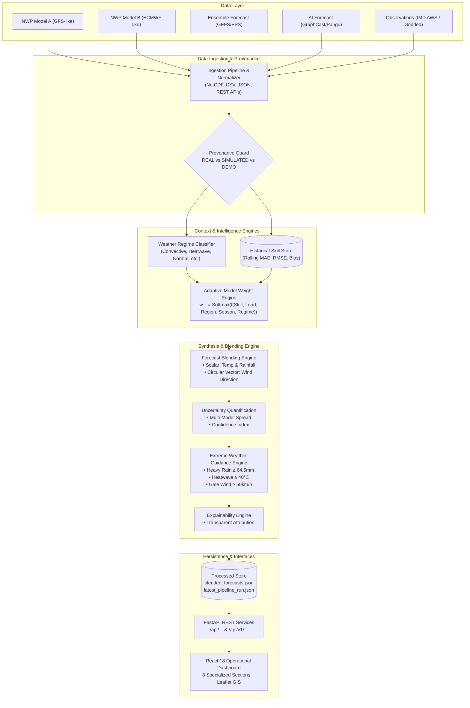

# System Architecture Documentation

> **Hybrid AI–NWP Multi-Model Forecast Blending System**  
> Operational Meteorology Platform for Smart India Hackathon (SIH)

---

## 1. Executive Architecture Overview

Operational meteorological forecasting requires balancing the physics consistency of **Numerical Weather Prediction (NWP)** models with the rapid inference and non-linear patterns of **Artificial Intelligence (AI)** models. Rather than relying on simple ensemble averaging, this system implements an **Adaptive Context-Aware Softmax Simplex Meta-Learner**.

---

## 2. Mathematical Foundation of Blending & Weighting

### A. Contextual Skill-to-Weight Mapping
For each model $m \in \{1, \dots, M\}$, target variable $v$, lead time $\tau$, region $r$, season $s$, and active weather regime $R$:

1. **Normalized Reliability Score**:
   $$S_m = \frac{1}{1 + \text{RMSE}_m(v, \tau, r, s, R)}$$
2. **Contextual Scaling**:
   $$Z_m = \frac{S_m}{\tau^\alpha} \cdot \gamma(R, m)$$
   where $\alpha$ is a lead-time dampening factor and $\gamma(R, m)$ is the regime affinity bonus.
3. **Adaptive Softmax Normalization**:
   $$w_m = \frac{\exp(Z_m / T)}{\sum_{j=1}^M \exp(Z_j / T)}$$
   subject to strict boundary constraints:
   $$\sum_{m=1}^M w_m = 1.0, \quad w_m \ge w_{\min} = 0.05$$

### B. Scalar Blending (Temperature & Rainfall)
$$F_{\text{blended}} = \sum_{m=1}^M w_m \cdot F_m$$
For rainfall, non-negativity is strictly preserved: $F_{\text{rainfall}} = \max(0.0, F_{\text{blended}})$.

### C. Circular Vector Averaging (Wind Direction)
Naive arithmetic averaging of angles fails at circular boundaries (e.g., $355^\circ$ and $5^\circ$ averages to $180^\circ$ instead of $0^\circ$). The system converts directions to unit vectors:

$$U = \sum_{m=1}^M w_m \cdot \sin\left(\theta_m \cdot \frac{\pi}{180}\right)$$
$$V = \sum_{m=1}^M w_m \cdot \cos\left(\theta_m \cdot \frac{\pi}{180}\right)$$
$$\theta_{\text{blended}} = \left(\text{atan2}(U, V) \cdot \frac{180}{\pi}\right) \pmod{360}$$

---

## 3. The 12-Step Automated Operational Pipeline

The entire system is orchestrated via [`AutomatedForecastPipeline`](file:///d:/GIT/MOES/backend/app/pipeline/workflow.py#L60):

1. **Step 1: Ingest Forecast Data**: Pulls forecasts across models (NWP Model A, NWP Model B, Ensemble, AI).
2. **Step 2: Ingest Observations**: Ingests in-situ station observations or gridded ground truth.
3. **Step 3: Validate Data**: Clamps physically impossible values, rejects NaN/missing spatial coordinates.
4. **Step 4: Preprocess Data**: Standardizes units (Kelvin $\rightarrow$ °C, kt $\rightarrow$ km/h), aligns timestamps.
5. **Step 5: Determine Weather Regime**: Diagnoses active synoptic regime (`Convective`, `Heat Wave`, `High Wind`, `Normal`).
6. **Step 6: Retrieve Historical Model Skill**: Queries rolling error scorecards for the active regime and lead time.
7. **Step 7: Calculate Adaptive Weights**: Computes dynamic normalized weights summing to 1.0.
8. **Step 8: Generate Blended Forecast**: Computes blended forecasts using scalar and circular vector math.
9. **Step 9: Calculate Uncertainty / Confidence**: Derives multi-model spread and $0.0-1.0$ confidence index.
10. **Step 10: Detect Extreme Events**: Evaluates IMD hazard thresholds for heavy rain, heat waves, and gales.
11. **Step 11: Store Results**: Persists blended forecasts and execution reports to disk.
12. **Step 12: Update Dashboard**: Dispatches live execution telemetry to the frontend dashboard.

---

## 4. Meteorological Data Provenance Architecture

To prevent simulated data from ever being misrepresented as ground-truth observations, the data ingestion layer implements strict provenance tagging:

- **`REAL DATA`**: Verified in-situ sensors (IMD AWS, WMO GTS) or operational NWP feeds (ECMWF, GFS).
- **`SIMULATED DATA`**: Computationally generated synthetic physical profiles. Carries mandatory scientific disclaimer:
  > *"CRITICAL DISCLAIMER: THIS IS SIMULATED / SYNTHETIC DATA GENERATED VIA NUMERICAL RULES. IT IS NOT REAL IN-SITU OBSERVATIONAL TELEMETRY AND MUST NOT BE PRESENTED AS GROUND TRUTH."*
- **`DEMO DATA`**: Packaged static benchmark demonstration fixtures.

---

## 5. Multi-Format Adapters

The system provides plug-and-play adapters for standard meteorological formats:
- **NetCDF Adapter (`.nc`)**: Pure-Python binary NetCDF-3 parser + CF-convention variable discovery (`t2m`, `tp`, `ws10`, `wdir`).
- **CSV Adapter (`.csv`)**: Tabular reader for IMD AWS bulletins and model dumps.
- **JSON Adapter (`.json`)**: GeoJSON FeatureCollection parser for AI models and REST API payloads.
- **Open-Meteo REST API Adapter**: Live operational NWP predictions and current weather telemetry.
